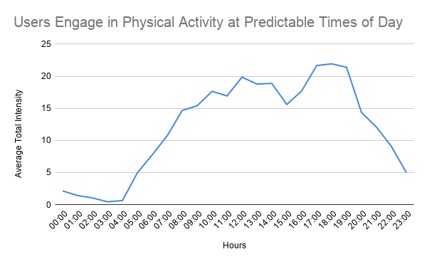
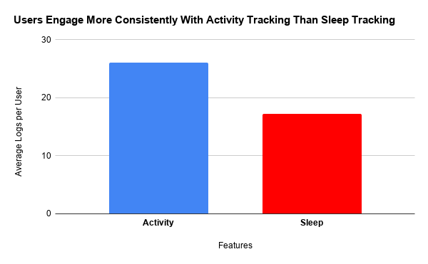

# Bellabeat Case Study

## Overview
This project analyzes smart device usage data to identify behavioral trends and generate business insights for Bellabeat, a wellness technology company. The analysis focuses on user activity, sleep, and engagement patterns to support data-driven marketing recommendations.

## Business Task
Analyze smart device usage data to discover trends in consumer behavior and provide insights that can help guide Bellabeat's marketing strategy.

## Tools Used
- R
- Google Sheets
- Kaggle Notebook

## Dataset
The analysis uses Fitbit Fitness Tracker data made available on Kaggle.

## Key Questions
- How do consumers use smart devices?
- What trends can be identified in daily activity and sleep patterns?
- How can these insights support Bellabeat's marketing strategy?

## Key Insights
- Users show varying levels of daily activity, with some demonstrating inconsistent engagement.
- Sleep tracking appears less consistently used compared to activity tracking.
- User behavior patterns reveal opportunities for more personalized wellness messaging and product positioning.

## Recommendations
- Promote Bellabeat products using behavior-based marketing strategies.
- Encourage deeper engagement with wellness tracking features.
- Target users with personalized campaigns based on activity and sleep patterns.

## Presentation
[View the full data storytelling presentation](https://docs.google.com/presentation/d/1km9ueqBwvnIh8knK1P0ktUl28nuDgNK2gjpJ_VS4W1g/edit?usp=sharing)

## Kaggle Notebook
[View the full notebook on Kaggle](https://www.kaggle.com/code/ayodejiemonehin/bellabeat-case-study)

## Project Preview

## Author
Ayodeji Emmanuel Monehin
